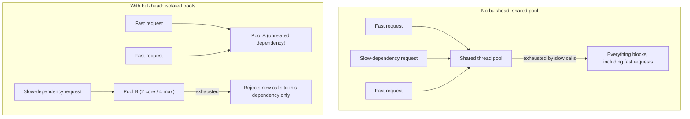

# Bulkhead

## Problem

[Circuit breaker](circuit-breaker.md) and [timeout/retry budgets](timeout-and-retry-budgets.md) both
assume a call to a dependency eventually returns, fails, or times out — but while it's in flight, it
occupies a resource: a thread, a connection. If every call to every dependency shares the same pool
of that resource, one slow or hanging dependency can consume the entire pool waiting on it, starving
requests that have nothing to do with that dependency at all. A bulkhead is the fix for that specific
failure mode: isolating capacity per dependency so one dependency's trouble can only ever exhaust its
own slice, never the whole pool.

## Key concepts

- **Shared pool vs isolated pool.** Without a bulkhead, every outbound call — to a database, a
  payment processor, a slow third-party API — draws from the same thread or connection pool. A
  bulkhead carves out a dedicated, bounded pool per dependency (or per group of dependencies with
  similar risk profiles), so exhausting one dependency's pool can't touch another's.
- **Thread-pool bulkhead vs semaphore bulkhead.** A thread-pool bulkhead runs the protected call on
  its own dedicated executor — real isolation, including from the caller's own thread, at the cost of
  the overhead of maintaining a separate pool. A semaphore bulkhead just caps concurrent calls on the
  caller's existing thread using a permit count — cheaper, but the calling thread itself is still the
  one blocked, so it doesn't protect against that thread being unavailable for other work.
- **Bounded queue, not unbounded.** A bulkhead's pool should reject or fail fast once both its
  concurrency limit and its queue are full, rather than queuing indefinitely — an unbounded queue in
  front of a bounded pool just delays the resource exhaustion instead of preventing it, and adds
  unbounded latency to every queued caller in the meantime.
- **What a bulkhead doesn't do.** It doesn't make the dependency succeed, and it doesn't reduce the
  cost of any single call — see [circuit breaker](circuit-breaker.md) for stopping calls to a clearly
  failing dependency altogether, and [graceful degradation](graceful-degradation.md) for what to
  return once a call is rejected or fails.

## Design



This diagram answers: *why does isolating capacity per dependency matter more than just making the
shared pool bigger?* A bigger shared pool delays the problem without changing its shape — enough
concurrent slow calls will still eventually consume it, and every request sharing that pool remains
exposed to that risk regardless of size. A dedicated, bounded pool per dependency changes what
"exhausted" means: exhausting dependency B's pool only ever rejects new calls to B, while requests
to A continue exactly as before, because they were never competing for the same resource in the
first place.

## Trade-offs

- **Thread-pool bulkhead vs semaphore bulkhead.** A thread-pool bulkhead genuinely isolates the
  protected call, including from the calling thread — a hung call on a dedicated pool can't tie up a
  thread the rest of the app needs, at the real overhead cost of maintaining a separate executor per
  guarded dependency. A semaphore bulkhead is cheaper (no separate pool) but the calling thread is
  still the one that blocks on the call — the isolation is concurrency-count isolation, not thread
  isolation. The signal: does the calling thread itself need to stay free for other work while this
  call is outstanding? If yes, thread-pool; if the concern is purely "don't let too many concurrent
  calls to this dependency pile up," semaphore is enough and cheaper.
- **Reject vs queue when the pool is full.** Rejecting immediately once the pool and its queue are
  full gives an instant, predictable failure the caller can act on (retry later, degrade). A larger
  queue absorbs short bursts without rejecting anything, at the cost of every queued request
  accumulating latency that compounds if the dependency stays slow. I'd size the queue for the
  burst I actually expect and no further: a queue deep enough to ride out sustained overload only
  converts a fast, actionable rejection into a slow one, which is the worse failure for a caller
  that still has its own timeout to answer to.

## Failure modes

- **No bulkhead at all.** The default state most systems start in — every dependency shares the same
  pool, so the single slowest or most unreliable dependency in the system sets a ceiling on
  everyone else's availability, even dependencies that are perfectly healthy.
- **A bulkhead sized from guesswork, never revisited.** Thread-pool sizes picked once and never
  checked against real concurrency and latency data either under- or over-provision — under-
  provisioning rejects healthy traffic unnecessarily; over-provisioning defeats the point by letting
  one dependency consume more shared-adjacent resource (memory, connection limits) than it should.
- **An unbounded queue in front of a bounded pool.** Looks like protection (the pool itself is
  bounded) but actually just delays and compounds the exhaustion — every request queued behind a
  slow dependency accumulates latency instead of failing fast, which can be worse for the caller than
  outright rejection.

## Operational considerations

Track rejected-call count per bulkhead as an explicit metric, separate from the dependency's own
error rate — a bulkhead actively rejecting calls is the signal that it's doing its job (shedding
load to protect the rest of the app), not itself a failure, but a sustained high rejection rate
means the pool is undersized for real traffic and needs revisiting, not just tolerating.

## Example

A thread-pool bulkhead configuration bounding concurrent calls to one dependency:

```yaml
resilience4j.bulkhead:
  instances:
    shipping:
      max-concurrent-calls: 4
      max-wait-duration: 0ms   # reject immediately once full, don't queue
```

## Interview questions

- What specifically does a bulkhead protect that a circuit breaker doesn't?
- Why does a thread-pool bulkhead provide stronger isolation than a semaphore bulkhead, and what does
  that isolation actually cost?
- Why is an unbounded queue in front of a bounded pool not real protection against resource
  exhaustion?
- How would you decide whether two dependencies should share a bulkhead or each get their own?

## Further experiments

`distributed-systems-playground`'s `resilience` example wraps a synchronous shipping-carrier call
with a real thread-pool bulkhead (2 core / 4 max / 2 queued), alongside a circuit breaker and a time
limiter — its
[README](https://github.com/Fragudev/distributed-systems-playground/blob/f893b1568b28f1ecab1babdc35292dcdfb0f49b0/examples/resilience/README.md)
documents `NaiveShippingGatewayFailureTest` proving the unprotected version's bug (an unbounded
block on every concurrent request), and `OrderApiResilienceTest` proving the bulkhead-protected
version keeps every one of 10 concurrent requests succeeding, with some visibly degrading instead of
blocking.
