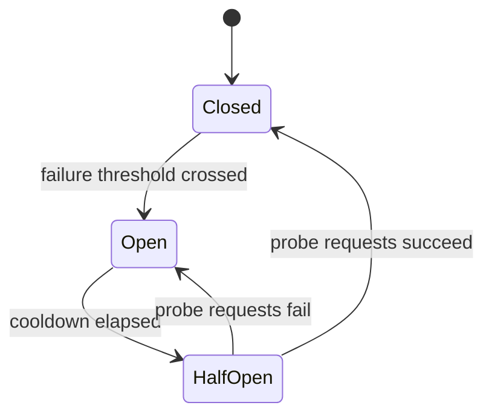

# Circuit breaker

## Problem

When a downstream dependency starts failing or slowing down, calling it normally on every request
keeps consuming the caller's own resources — threads, connections, memory — on each attempt. Under
load, this turns a downstream problem into a caller-side outage: the caller's thread pool fills up
waiting on a dependency that was never going to answer in time, and requests that have nothing to do
with that dependency start failing too, because there's no capacity left to serve them.

## Key concepts

- **Closed state**: normal operation — requests pass through to the dependency, failures are
  counted.
- **Open state**: the failure threshold has been crossed — requests fail immediately without calling
  the dependency at all, for a configured cooldown period.
- **Half-open state**: after the cooldown, a limited number of requests are allowed through as a
  probe. If they succeed, the breaker closes; if they fail, it reopens and the cooldown restarts.
- **Failure threshold**: the rule that trips the breaker — a raw count, a rate over a rolling window,
  or a combination with a minimum request volume (to avoid tripping on 2 failures out of 2 requests
  during low traffic).

## Design



This diagram answers: *what stops the breaker from just flapping between failing and working forever
under a partially-degraded dependency?* The half-open state is the answer — it limits how much
traffic is risked on the recovery question ("is it actually better now?") instead of either fully
resuming traffic (which could re-trip immediately and repeat the damage) or staying open forever
(which would never recover once the dependency actually healed). The cooldown before probing is what
gives the dependency time to recover before being hit again, rather than being re-tested the instant
it starts failing.

The critical design decision the diagram doesn't show: **what happens on `Open`?** A circuit breaker
that fails fast with no fallback has only converted a slow failure into a fast one — often the right
trade (fast failures don't exhaust caller thread pools) but only a complete answer if the caller has
something useful to do with a fast failure: a cached response, a degraded-but-functional default, or
a clear error the end user can act on.

## Trade-offs

- **Threshold sensitivity.** A low threshold trips fast, protecting the caller aggressively, but
  risks false positives on a dependency that's briefly slow rather than actually failing — every
  unnecessary trip denies traffic to a dependency that could have served it. A high threshold avoids
  false positives but lets more damage accumulate before protection kicks in. The signal to tune on:
  how expensive is a false trip (denying good traffic) relative to how expensive is delayed
  protection (cascading failure) — payment processing usually wants a higher threshold (avoid
  false trips) than an internal recommendation service (fail fast, it's not critical).
- **Per-dependency vs shared breakers.** A single breaker guarding all calls to a downstream service
  is simpler to operate, but conflates unrelated endpoints on that service — one slow endpoint trips
  protection for a fast, healthy one on the same dependency. Per-endpoint breakers isolate the blast
  radius correctly at the cost of more state to configure and monitor.

## Failure modes

- **No fallback on open.** The breaker correctly stops calling a failing dependency, but the caller
  has nothing else to return — the fast failure just propagates up, and the caller looks just as
  broken to its own callers as before, only faster.
- **Threshold too tight for normal variance.** A dependency with naturally bursty latency trips the
  breaker on ordinary jitter, denying traffic to a dependency that was actually fine — indistinguishable
  from a real outage to anyone just watching the breaker's state, without also watching the
  dependency's actual health.
- **Breaker per-instance instead of shared state**, in a horizontally scaled caller: each instance
  trips independently based only on its own observed failures, so a dependency failing only for
  some callers (a partial network issue) never crosses any single instance's threshold even though
  the aggregate failure rate across all instances would have.

## Operational considerations

Circuit breaker state (closed/open/half-open) should be an exported, alertable metric per guarded
dependency — an unexpected transition to open is one of the fastest available signals that a
downstream dependency has degraded, often faster than the dependency's own alerting fires.

## Example

Resilience4j-style configuration expressing the threshold and cooldown:

```java
CircuitBreakerConfig config = CircuitBreakerConfig.custom()
    .failureRateThreshold(50)              // trip at 50% failure rate
    .slidingWindowSize(20)                 // over the last 20 calls
    .waitDurationInOpenState(Duration.ofSeconds(30))
    .permittedNumberOfCallsInHalfOpenState(5)
    .build();
```

## Interview questions

- Why does a circuit breaker need a half-open state instead of just closing again after the cooldown?
- What does "open" actually protect, and what does it leave unprotected without a fallback?
- How would you decide the failure threshold differently for a critical dependency versus a
  non-critical one?
- What goes wrong with per-instance breaker state in a horizontally scaled service?

## Further experiments

Pairs with [timeout and retry budgets](timeout-and-retry-budgets.md) — a circuit breaker without a
sane timeout on the underlying call can't accumulate failures fast enough to trip before the damage
is done; the two are usually configured together, not as alternatives.
