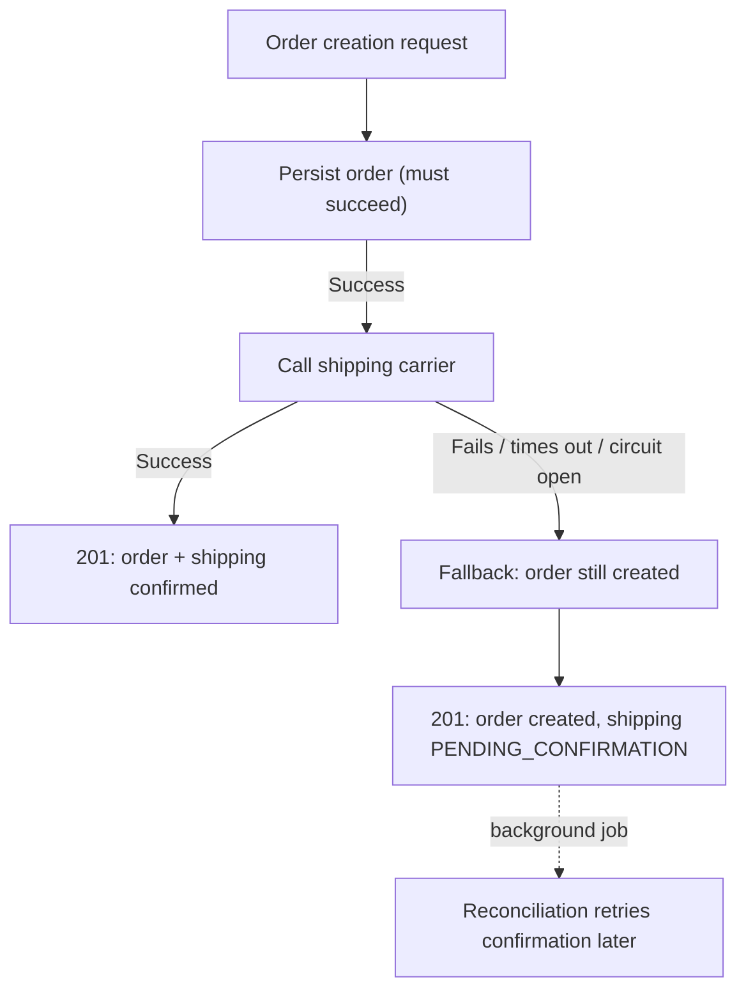

# Graceful degradation

## Problem

[Circuit breaker](circuit-breaker.md) and [bulkhead](bulkhead.md) both stop a struggling dependency
from taking down the rest of the system — but stopping the call is only half the problem. What the
caller *returns* once that call is rejected, times out, or fails determines whether the end user
experiences a real, if reduced, outcome, or the exact same failure just arriving faster. Graceful
degradation is the design of that fallback: deciding, for a given dependency, what the request can
still meaningfully do without it, and what it genuinely can't.

## Key concepts

- **Degrade vs fail.** A degraded response completes the request with something less than the full
  experience — a stale cached value, a deferred confirmation, a feature quietly turned off — rather
  than returning an error. Whether degrading is even possible depends entirely on the specific
  dependency and request: some outcomes genuinely require the failed call to have succeeded (a
  payment charge) and have no meaningful degraded version.
- **What the fallback preserves vs what it defers.** A good fallback is explicit about which part of
  the original request's promise it's keeping and which part it's postponing — "the order was
  created, shipping confirmation is pending" preserves the order and defers only the one part that
  actually depended on the failed call, rather than failing the entire request over one dependency
  that wasn't on the critical path for most of it.
- **Reconciliation is part of the design, not an afterthought.** A degraded outcome that's never
  revisited (the deferred shipping confirmation that's never retried or checked) isn't graceful
  degradation — it's silent, permanent partial failure wearing a success response. The fallback
  needs a real path back to completeness, even if that path is a background job rather than
  something the original request waits for.
- **Deciding this ahead of time, per dependency.** Which failures are safe to degrade and which must
  fail the whole request is a decision that has to be made deliberately for each dependency a
  request touches — treating every dependency the same (either "always degrade" or "always fail
  hard") gets some of them wrong in one direction or the other.

## Design



This diagram answers: *why does the shipping call happening after the order is persisted matter for
what "graceful" actually means here?* Because it defines which outcome is on the critical path and
which isn't — the order's existence doesn't depend on the carrier at all, so a carrier failure has
no reason to fail the whole request. If the shipping call happened *before* persistence, inside the
same transaction, there'd be nothing left to degrade gracefully — the order literally couldn't exist
without the carrier call succeeding, and the only honest options would be fail the request or accept
a genuinely different (and riskier) design.

## Trade-offs

- **Degrade this dependency vs fail the whole request.** Degrading keeps the request succeeding for
  the parts that don't depend on the failed call, at the cost of a response that's now more complex
  to reason about (its meaning depends on which parts actually completed) and a real obligation to
  reconcile the deferred part later. Failing the whole request is simpler to reason about (it either
  fully succeeded or didn't) but throws away work that already completed successfully whenever any
  one dependency, however peripheral, fails. The signal: is this dependency's outcome something the
  request's core purpose can exist without? An order can exist without a shipping confirmation; it
  generally can't exist without a validated payment.
- **Build reconciliation now vs defer it.** A background job that retries deferred outcomes closes
  the loop a fallback opens, but is real engineering effort separate from the fallback path itself —
  deferring it is reasonable scope-limiting for a first version, as long as it's named as a real gap
  rather than left implicit, since an unreconciled degraded state is exactly the silent-partial-
  failure risk described above.

## Failure modes

- **A degraded response indistinguishable from full success.** If the response doesn't signal that
  something was deferred (same status code, no field indicating partial completion), the caller of
  *this* system has no way to know reconciliation is needed — the degradation silently propagates as
  if everything succeeded.
- **No reconciliation path at all.** A fallback that defers an outcome but has no mechanism to ever
  revisit it turns "gracefully degraded" into "permanently and silently incomplete" — the difference
  between the two is entirely in whether something eventually closes the loop.
- **Degrading a dependency that shouldn't be degradable.** Applying a fallback pattern uniformly to
  every dependency, including ones whose success is genuinely required (a payment charge, an
  inventory reservation that prevents overselling), produces responses that claim success for
  requests that didn't actually complete what they promised.

## Operational considerations

Track degraded-response rate as its own metric, separate from error rate — a rising rate of
successful-but-degraded responses is a real signal (the dependency behind that fallback is
struggling) even though nothing in the error rate moved, since every one of those requests still
returned a `2xx`.

## Example

The response shape that makes a degraded outcome distinguishable from a fully completed one:

```java
if (shippingResult.isFailure()) {
    return OrderResponse.created(order, ShippingStatus.PENDING_CONFIRMATION);
    // Still a 201 — the order is real — but the caller can see shipping wasn't confirmed
    // and knows not to treat this response as identical to the fully-succeeded case.
}
return OrderResponse.created(order, ShippingStatus.CONFIRMED);
```

## Interview questions

- What determines whether a given dependency's failure can be gracefully degraded versus must fail
  the whole request?
- Why is a degraded response that looks identical to a fully successful one a real problem, not just
  a cosmetic detail?
- Why does reconciliation need to be part of the design, not an optional add-on?
- How would the answer to "degrade or fail" change between a shipping confirmation and a payment
  charge, and why?

## Further experiments

`distributed-systems-playground`'s `resilience` example implements exactly this: the shipping call
happens after the order transaction has already committed, so a circuit-open or bulkhead-rejected
call falls back to a real `PENDING_CONFIRMATION` response rather than failing order creation — its
[README](https://github.com/Fragudev/distributed-systems-playground/blob/f893b1568b28f1ecab1babdc35292dcdfb0f49b0/examples/resilience/README.md)
names the deferred reconciliation job as real, accepted scope-limiting debt rather than a closed
loop, and explicitly states when *not* to use this pattern — a payment charge that must succeed for
the order to be valid at all.
