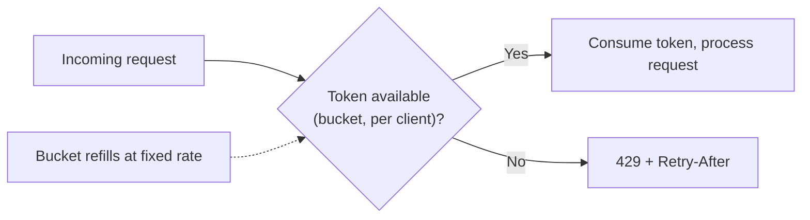

# Rate limiting

## Problem

[Bulkhead](bulkhead.md) and [timeout/retry budgets](timeout-and-retry-budgets.md) protect a system
from *outbound* calls to a struggling dependency. Rate limiting protects the reverse direction: an
uncapped volume of *incoming* requests, whether from a legitimate traffic spike, a misbehaving
client retrying too aggressively, or deliberate abuse, can exhaust a system's own capacity the same
way an unprotected outbound call can exhaust a caller's thread pool. It's easy to defer — nothing
breaks in normal testing without it — which is exactly why it tends to stay a documented gap rather
than a built control, right up until the first time real traffic actually needs it.

## Key concepts

- **Token bucket**: a bucket refills at a fixed rate up to a capacity; each request consumes a
  token, and a request with no token available is rejected or delayed. Naturally allows short bursts
  up to the bucket's capacity while enforcing a steady long-run rate — the most common general-
  purpose choice because it doesn't punish a client for a brief burst the way a rigid fixed-window
  count would.
- **Sliding window vs fixed window.** A fixed window (e.g., "100 requests per minute, resetting on
  the minute boundary") allows a client to send 100 requests in the last second of one window and
  another 100 in the first second of the next — 200 requests in two seconds, technically within
  limit. A sliding window counts requests over a continuously moving interval, closing that edge
  case at the cost of more state to track per client.
- **Per-client vs global limits.** A global limit protects the system's aggregate capacity but lets
  one client's excessive traffic crowd out every other client's fair share. A per-client limit
  protects fairness between clients but doesn't, by itself, bound the system's total load if enough
  clients are active simultaneously — most real systems need both, not one instead of the other.
- **Reject vs shape.** Rejecting a request over the limit (usually with a `429` and a `Retry-After`
  hint) is the simplest response. Shaping — queuing or delaying the request instead of rejecting it
  outright — smooths bursts into the allowed rate, at the cost of added latency and a queue that
  itself needs to be bounded, or it becomes the same unbounded-queue problem a
  [bulkhead](bulkhead.md) without a queue limit has.

## Design



This diagram answers: *why does a token bucket allow a burst at all, instead of enforcing a perfectly
smooth rate?* Because real traffic isn't smooth — a legitimate client can have a genuine reason to
send several requests in quick succession (a page load firing multiple calls at once) and shouldn't
be punished for that as long as its *average* rate stays within bound. The bucket's capacity is what
defines "how much burst is tolerated" independently of "what's the sustained rate," which is exactly
the two separate knobs a fixed-window counter conflates into one.

## Trade-offs

- **Global limit vs per-client limit vs both.** A global-only limit protects total capacity but is
  unfair — one noisy client can consume the entire budget, starving everyone else. A per-client-only
  limit is fair between clients but doesn't cap aggregate load if enough clients are simultaneously
  active near their individual limits. Running both — a per-client limit for fairness, a global limit
  as the actual capacity backstop — costs more state to track but is what most systems serving
  multiple clients over shared infrastructure actually need.
- **Reject vs shape (queue) over-limit requests.** Rejecting immediately is simple, cheap, and gives
  the client a clear, actionable signal (back off, retry later). Shaping smooths bursts and can avoid
  failing a request that would have succeeded a moment later, at the cost of added latency and a
  queue that needs its own bound — worth it for traffic that's naturally bursty but not abusive;
  rejecting outright is usually the safer default when the traffic exceeding the limit might be
  actively hostile, not just impatient.

## Failure modes

- **No rate limiting, deferred as "not urgent yet."** The most common real-world state: nothing in
  normal load testing exercises the gap, so it stays undeployed until either a legitimate traffic
  spike or an actively abusive client demonstrates the cost of not having it — usually during an
  incident, the worst time to add a new control under pressure.
- **A limit enforced only at one layer.** Rate limiting applied only at an API gateway but not on an
  internal service that gateway calls (or vice versa) leaves the ungated layer exposed to anything
  that can reach it directly, bypassing the gateway — the limit needs to sit at every layer that can
  actually be reached independently, not just the outermost one.
- **A fixed-window counter with no burst tolerance considered.** Rejecting a legitimate client that
  briefly bursts within its overall average rate, because the window boundary happened to fall in
  the wrong place, trains well-behaved clients to work around the limiter rather than trust it.

## Operational considerations

Rejected-request rate (429s) is the primary signal, but it needs to be read alongside *who* is being
rejected — a rejection rate concentrated on one client is a fairness or abuse question; a rejection
rate spread evenly across many clients during a traffic spike is a capacity question, and the two
call for entirely different responses (block one client vs scale the system).

## Example

A token-bucket check, rejecting once the bucket for a given client is empty:

```java
Bucket bucket = buckets.computeIfAbsent(clientId, id ->
    Bucket.builder()
        .addLimit(Bandwidth.classic(100, Refill.greedy(100, Duration.ofMinutes(1))))
        .build());
if (!bucket.tryConsume(1)) {
    return ResponseEntity.status(429).header("Retry-After", "60").build();
}
```

## Interview questions

- Why does a token bucket allow bursts while still enforcing a long-run average rate, and why is
  that usually the right behavior?
- What specifically goes wrong with a fixed-window rate limiter that a sliding window fixes?
- Why do most systems serving multiple clients need both a per-client and a global limit, rather
  than just one?
- What's the risk of enforcing a rate limit only at the outermost layer of a system?

## Further experiments

`ai-engineering-lab`'s
[threat model](https://github.com/Fragudev/ai-engineering-lab/blob/ec822bca9df3aee3dc6857705dcddd171a669211/docs/threat-model.md)
names rate limiting explicitly as a **planned, not built** mitigation for its denial-of-service
threat (T5) — an honest, documented gap rather than a silently assumed control, and a real example
of exactly the deferral pattern this topic's failure modes describe: acceptable for a single-user
deployment today, named as a real risk the moment that assumption changes.
