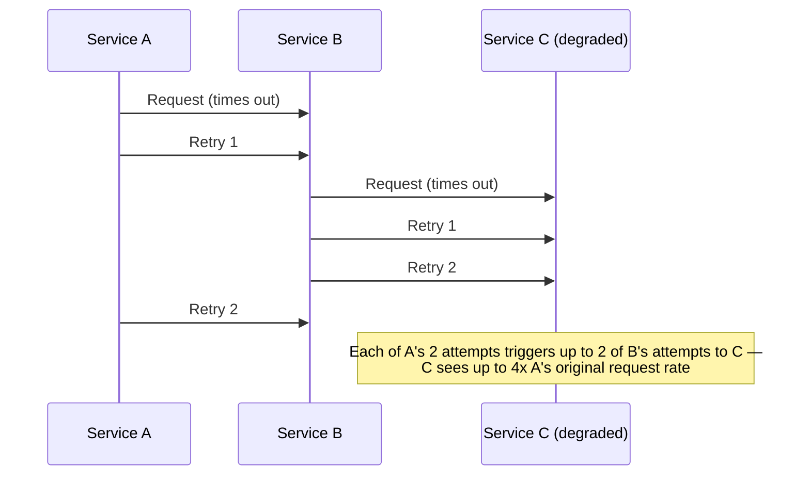

# Timeout and retry budgets

## Problem

Retrying a failed call seems like an unconditionally good idea — it improves the odds that a single
request eventually succeeds. But retries without a cap and without a sane timeout amplify load on a
dependency that's *already* struggling: each failed request becomes two, three, or more attempts,
and if that dependency is itself calling another dependency that also retries, the amplification
multiplies at every hop. This is the mechanism behind a **retry storm** — a system that would have
recovered from a transient blip on its own gets kept down by the very retries meant to route around
the problem.

## Key concepts

- **Connect timeout vs read timeout**: how long to wait to establish a connection versus how long to
  wait for a response after the connection is made. Conflating them (one timeout for both) usually
  means the value is wrong for at least one of the two very different failure modes they're meant to
  catch.
- **Exponential backoff**: each retry waits longer than the last (typically doubling), reducing the
  rate at which a struggling dependency is hit compared to immediate retries.
- **Jitter**: randomizing the backoff delay slightly so that many clients that failed at the same
  moment (a dependency blip affecting all of them simultaneously) don't all retry in lockstep and
  recreate the exact same spike a moment later.
- **Retry budget**: a cap on the *fraction* of total traffic that's allowed to be retries (e.g., no
  more than 10% of requests to a dependency may be retries), independent of any single caller's
  retry count — this is what actually prevents systemic amplification, as opposed to per-request
  backoff, which only slows down one caller's own retries.

## Design



This diagram answers: *why does a retry policy that looks reasonable at each hop become dangerous
across a call chain?* Each service's retry count multiplies with every other service's retry count
along the path to the degraded dependency — a policy of "retry twice" at every hop of a 3-hop chain
means the origin of the chain (C, here) can see up to 8x the nominal request rate from a single
original client request. C is degraded in this diagram precisely *because* it's receiving amplified
retry traffic, which is the retry storm: the mechanism meant to help is what's keeping it down.

## Trade-offs

- **Aggressive per-request retries vs system-wide retry budget.** Retrying aggressively maximizes
  the chance any single request eventually succeeds, which looks good in isolation. A retry budget
  caps total retry traffic across all callers, protecting the dependency's ability to recover at the
  cost of some individual requests failing outright once the budget is exhausted rather than being
  retried. I default to a retry budget on any call chain more than two hops deep, or any dependency
  shared by multiple callers — the individual-request view is the wrong level to reason about
  amplification at.
- **Retrying at every hop vs retrying only at the edge.** If every service in a chain retries
  independently, amplification compounds as shown above. Retrying only at the outermost boundary (or
  making only specific hops retry-eligible, with the rest propagating failure immediately) keeps
  amplification linear instead of exponential — the trade-off is that an inner hop's transient
  failure now always surfaces as a failure to its immediate caller instead of being silently
  absorbed, which requires that caller to be the one that decides whether to retry.

## Failure modes

- **Retry-induced outage**: a dependency that was going to recover from a brief blip on its own stays
  down because retry traffic from every caller in the chain keeps its load above the level it can
  recover at — the retries are not incidental to the outage's duration, they're the direct cause of
  it continuing.
- **Retrying non-idempotent operations.** A retry is only safe if the operation is
  [idempotent](../distributed-systems/idempotency.md) — retrying a payment charge that actually
  succeeded but whose response was lost duplicates the charge. Retry logic and idempotency are a
  package deal; one without the other is either unsafe (retry without idempotency) or pointless
  (idempotency with no retry to protect against).
- **No jitter**: many clients failing at the same instant (a brief dependency blip affecting all of
  them) back off with identical delays and retry in a synchronized spike, recreating the original
  overload a fixed interval later, repeatedly, instead of smoothing the retry traffic out over time.

## Operational considerations

Retry rate as a fraction of total request volume to a dependency is the metric that catches this
before it becomes an outage — a climbing retry fraction, independent of overall traffic, is the
earliest signal of a dependency starting to degrade, well before its own error rate or latency
metrics move enough to page anyone.

## Example

Exponential backoff with jitter and a hard cap on attempts:

```java
long baseDelayMs = 100;
for (int attempt = 0; attempt < maxAttempts; attempt++) {
    try {
        return call();
    } catch (RetryableException e) {
        long backoff = baseDelayMs * (1L << attempt);          // exponential
        long jitter = ThreadLocalRandom.current().nextLong(backoff);
        Thread.sleep(jitter);                                   // full jitter
    }
}
throw new ExhaustedRetriesException();
```

## Interview questions

- Why can a retry policy that's reasonable at a single hop become dangerous across a multi-hop call
  chain?
- What's the difference between per-request backoff and a system-wide retry budget, and why does one
  not substitute for the other?
- Why is retrying a non-idempotent operation unsafe even with correct exponential backoff?
- What metric would tell you a retry storm is starting before dependency error rates spike?

## Further experiments

Pairs directly with [circuit breaker](circuit-breaker.md) — a circuit breaker is effectively the
retry budget's last line of defense: once retries have driven the failure rate past the breaker's
threshold, it stops the amplification outright instead of merely capping it.
