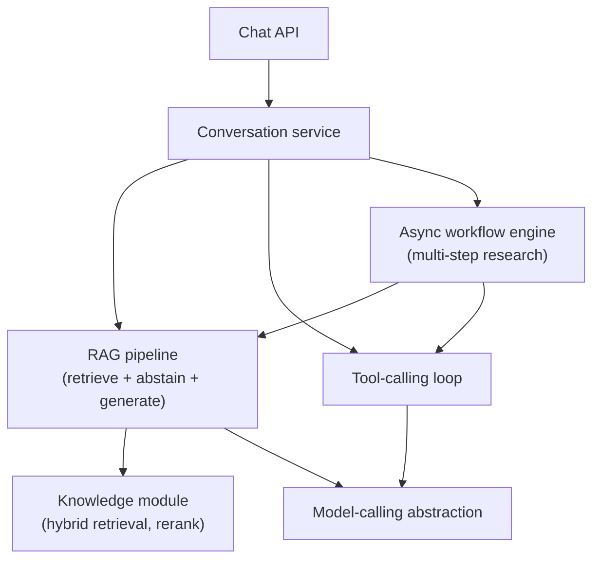

# System Design: AI Knowledge Assistant

## 1. Requirements

Design a system where a user asks a question in natural language and gets an answer grounded in a
private document corpus, with citations, able to call tools when a question needs something beyond
retrieval (a calculation, a live lookup) — an AI knowledge assistant. Chosen as the final worked
exercise, and deliberately different from every prior one: instead of a hypothetical design, this
exercise is built by composing topics already covered in depth elsewhere in this playbook, and
points directly at [`ai-engineering-lab`](https://github.com/Fragudev/ai-engineering-lab), a real,
running implementation of exactly this system — the design decisions below are the ones that system
actually made, not ones invented for this exercise.

## 2. Functional requirements

- A user asks a question; the system retrieves relevant context from an ingested document corpus
  (see [Document processing](document-processing.md)) and generates a cited answer.
- The system abstains, explicitly, when the corpus doesn't contain relevant context for the question
  (see [Hallucination mitigation](../ai-engineering/hallucination-mitigation.md)), rather than
  answering from parametric knowledge alone.
- The assistant can call tools mid-conversation (a calculator, a scoped external lookup) when a
  question needs something retrieval alone can't answer.
- A longer-running research task (multi-step, several sub-questions) can be dispatched as an
  asynchronous workflow rather than answered in a single turn.
- Conversation history is retained per session, queryable and resumable.

## 3. Non-functional requirements

- **Grounded, not merely fluent**: every claim in a generated answer must be traceable to a specific
  retrieved chunk, or the system must abstain — fluency without grounding is treated as a defect, not
  an acceptable output.
- **Bounded cost and latency per turn**: no single conversation turn can trigger unbounded model
  calls (see [Cost/latency trade-offs](../ai-engineering/cost-latency-tradeoffs.md)) — a hard,
  enforced ceiling, not a best-effort guideline.
- **Tool calls are authorized independently of the model's own decision to call them** — a model
  convinced to attempt a tool call it shouldn't have access to must still be rejected (see
  [prompt injection](../ai-engineering/prompt-injection.md)).
- **Not required**: multi-tenant corpus isolation at massive scale (this exercise assumes a single
  corpus scope; a real multi-tenant deployment is a genuinely larger redesign, not covered here),
  fine-tuning or training a custom model.

## 4. Assumptions

- A moderate-sized corpus (thousands, not millions, of documents) — large enough that retrieval
  quality is a real design concern, small enough that the corpus fits comfortably alongside
  operational data in one datastore (see [Embeddings](../ai-engineering/embeddings.md)).
- A single chat-capable model serves both generation and, where used, LLM-based reranking and
  judging — no separate cross-encoder or judge-specific model in the stack (see
  [Retrieval/reranking](../ai-engineering/retrieval-reranking.md)).
- Tool calls are to a small, explicitly registered set (a calculator, a scoped internal search) —
  not an open-ended, arbitrary-code-execution capability.
- One contributor, one deployment cadence, no component with an independently justified scaling
  profile — the conditions [LLM application architecture](../ai-engineering/llm-application-architecture.md)
  names as pointing toward a modular monolith, not microservices.

## 5. Capacity estimation

- This system's binding constraint isn't request volume (a knowledge assistant's real usage is
  nowhere near [event ingestion](event-ingestion-platform.md)'s scale) — it's *per-turn* cost and
  latency: a single chat turn can trigger a retrieval call, a rerank call, and a generation call,
  each with real token cost and real latency, compounding per turn in a way a stateless CRUD
  endpoint's request cost never does.
- A multi-step research workflow (see [Agents and workflows](../ai-engineering/agents-and-workflows.md))
  can issue many LLM calls per run — this is why a hard per-run call cap (not just a per-turn one)
  is a capacity decision here, not only a reliability one, directly bounding worst-case cost per
  workflow invocation.
- Retrieval latency and generation latency are genuinely different systems' response times (this
  application's own index versus the model server) — conflating them into one "answer latency" number
  hides which one to actually investigate when a request is slow (see [Traces](../observability/traces.md)).

## 6. High-level architecture



This diagram answers: *why does the workflow engine call into RAG and tools, rather than the
conversation service composing all three as peers?* Because a multi-step research task's own steps
genuinely need retrieval and tool execution as building blocks — the workflow engine owns its own
run loop and calls into its dependencies directly (see
[LLM application architecture](../ai-engineering/llm-application-architecture.md)), the same
precedent that puts tool-calling's own loop inside the tool-calling service rather than the
conversation layer composing it turn by turn. A single-turn chat question never touches the workflow
engine at all — it's a genuinely separate capability, not every request's default path.

## 7. Data model

```text
conversations
  id                uuid         primary key
  created_at        timestamptz  not null

messages
  id                uuid         primary key
  conversation_id   uuid         not null references conversations(id)
  role              varchar(10)  not null            -- user | assistant | tool
  content           text         not null
  citations         jsonb        null                -- chunk references backing this message's claims

chunks                                                -- see Document processing §7 for the full model
  id                uuid         primary key
  embedding         vector       not null
  content_tsv       tsvector     not null             -- lexical retrieval, same table, no second store
```

`citations` living directly on the message row, not inferred after the fact, is what makes "every
claim traceable to a chunk" (§3) a queryable property of the stored conversation, not something that
has to be recomputed or trusted from the model's own output alone.

## 8. API design

```text
POST /conversations/{id}/messages
  body: { "content": "What does the retry policy do on a timeout?" }
  200: { "message_id": "...", "content": "...", "citations": [{"chunk_id": "...", "text": "..."}] }

POST /workflows/documentation-research
  body: { "question": "..." }
  202: { "run_id": "...", "status": "PENDING" }

GET /workflows/runs/{run_id}
  200: { "status": "SUCCEEDED", "answer": "...", "citations": [...], "steps": [...] }
```

## 9. Communication model

A single-turn chat message is synchronous — retrieval and generation together are expected to
complete within an ordinary request timeout, unlike this playbook's other exercises. The multi-step
research workflow is the one path that follows the `202`-then-poll pattern every other exercise
uses, for the same reason: a multi-stage pipeline (plan, retrieve, extract, synthesize, self-check)
can genuinely take minutes, well past what a synchronous request should hold open (see
[Agents and workflows §Design](../ai-engineering/agents-and-workflows.md#design)).

## 10. Scaling strategy

- Retrieval, tool execution, and generation each scale independently, behind the provider abstraction
  and knowledge module boundaries named in §6 — a retrieval-quality improvement (adding reranking)
  never requires touching generation code, and a provider swap never requires touching retrieval code
  (see [LLM application architecture](../ai-engineering/llm-application-architecture.md)).
- The workflow engine's per-run LLM-call cap (§5) is the scaling control specific to multi-step
  research — bounding worst-case cost per run independently of how many concurrent runs the system
  accepts.
- Corpus growth is absorbed by the retrieval layer's own scaling path (see
  [Embeddings](../ai-engineering/embeddings.md)'s vector-store choice and
  [Sharding](../databases/sharding.md) if the corpus eventually outgrows a single-node index) — a
  separate concern from chat-turn request volume entirely.

## 11. Consistency model

A chat answer's grounding is decided at generation time from whatever the retrieval step returned at
that moment — if the corpus is updated a moment later, an already-generated answer isn't
retroactively corrected, the same "eventually consistent, converges going forward, not backward"
shape as every other exercise's async processing. A multi-step workflow run is resumable and
idempotent by construction (see
[Agents and workflows §Design](../ai-engineering/agents-and-workflows.md#design)) — a restart resumes
from the last completed step rather than restarting or duplicating work.

## 12. Failure handling

- **Retrieval finds nothing relevant.** The system abstains explicitly ("insufficient context")
  rather than generating from parametric knowledge alone — the calibrated distance gate covered in
  [Hallucination mitigation](../ai-engineering/hallucination-mitigation.md), not a guessed threshold.
- **A tool call fails or is rejected.** Handled the same way any tool-calling system handles a failed
  call (see [Structured output and tool-calling reliability](../ai-engineering/structured-output-and-tool-calling-reliability.md))
  — validated, authorized independently of the model's request, and a clean failure surfaced to the
  conversation rather than silently retried without bound.
- **A workflow step fails after retries are exhausted.** The run reaches a clean `FAILED` terminal
  state with a recorded reason — compensation, not a silent partial or fabricated result (see
  [Agents and workflows](../ai-engineering/agents-and-workflows.md)'s compensation concept).

## 13. Observability

- Retrieval and generation latency are tracked as separate spans, never merged into one number — see
  [Traces](../observability/traces.md)'s explicit rejection of a combined span, for the same reason:
  they're two different systems' latency, and conflating them hides which one to investigate.
- Token cost and abstention rate per conversation are tracked as first-class metrics, not
  afterthoughts — abstention rate specifically as the leading indicator that corpus coverage or
  threshold calibration needs attention (see [Hallucination mitigation](../ai-engineering/hallucination-mitigation.md)).
- `conversation_id` (and `run_id` for workflows) is the correlation key tying a user's question
  through retrieval, tool calls, and generation back together for debugging one interaction.

## 14. Security

- Every tool call is authorized independently of whether the model decided to request it — the
  structural fix to prompt injection this playbook covers in depth (see
  [prompt injection](../ai-engineering/prompt-injection.md)), not a prompt-level instruction asking
  the model to behave.
- Retrieved document content is untrusted the moment it's shown to the model — indirect prompt
  injection via an ingested document is a real, named threat class, mitigated the same way: an
  authorization boundary independent of the model's own decision, not a hope that the model resists
  the injected instruction.
- Model output is never rendered as markup without going through the same safe-rendering discipline
  named in [AI security](../ai-engineering/ai-security.md) — a real, previously found vulnerability
  class in exactly this kind of system.

## 15. Cost considerations

Every retrieval, rerank, and generation call has a real, measurable token/latency cost (see
[Cost/latency trade-offs](../ai-engineering/cost-latency-tradeoffs.md)) — the design's actual cost
lever is choosing the cheapest strategy that meets a measured quality bar per component (dense-only
vs hybrid retrieval, MMR vs LLM-based reranking), decided from the evaluation harness's own
recall/cost table (see [Evaluation](../ai-engineering/evaluation.md)), not from intuition about which
option sounds more sophisticated.

## 16. Alternatives

- **A single "do everything" prompt with no structural separation between retrieval, tools, and
  generation.** Simpler to prototype, but makes independent testing, swapping, and reasoning about
  each concern impossible — rejected for exactly the reasons
  [LLM application architecture](../ai-engineering/llm-application-architecture.md) names against
  collapsing concerns into one undifferentiated layer.
- **Microservices per capability** (a separate deployable for retrieval, tools, generation).
  Rejected under this exercise's assumptions (§4) — one contributor, one deployment cadence, no
  component with an independently justified scaling profile — the same reasoning
  [modular monolith vs microservices](../architecture/modular-monolith-vs-microservices.md) applies
  generally, with enforced module boundaries providing the real isolation instead.

## 17. Evolution path

- **MCP client/server exposure**: the tool registry exposed as an MCP server, and external MCP
  servers consumed as a client — a real, distinct trust boundary requiring its own confirmation gate
  (see [MCP](../ai-engineering/mcp.md)), not a trivial extension of the existing tool-calling loop.
- **Cross-encoder reranking**: the natural next candidate once evaluation shows MMR/LLM-based
  reranking underperforming for the real corpus and query mix (see
  [Retrieval/reranking](../ai-engineering/retrieval-reranking.md)) — a new model dependency, not a
  configuration change.
- **Multi-tenant corpus isolation**: scoped out of this exercise's assumptions (§4) — a genuinely
  larger redesign touching retrieval, storage, and authorization together, not an incremental
  addition to the single-corpus design here.
