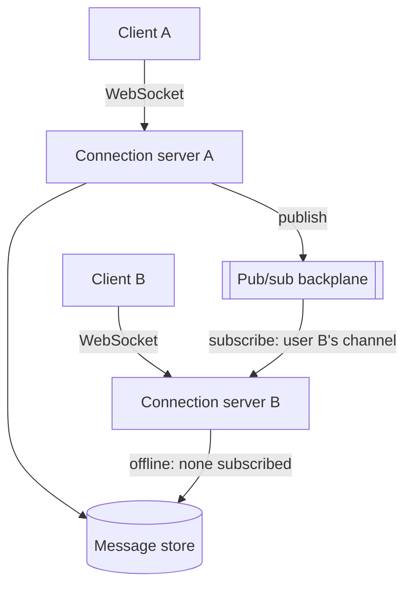

# System Design: Chat System

## 1. Requirements

Design a system supporting one-to-one and small-group real-time messaging: a message sent by one
user is delivered to the recipient(s) within milliseconds if they're online, and stored for delivery
when they reconnect if not. Chosen as the fourth worked exercise because its central tension is
unique among the exercises so far: a persistent, stateful connection per online user (a WebSocket)
that a load balancer's usual stateless-request assumption doesn't hold for, forcing a real answer to
"how does a message from user A reach user B's connection, when that connection could be held by any
one of many server instances."

## 2. Functional requirements

- A user sends a message to another user or a small group (up to ~50 members); recipients who are
  online receive it in real time.
- A user who's offline receives queued messages on reconnect, in the order they were sent.
- Message history per conversation is retrievable, paginated, in send order.
- Delivery and read receipts (sent, delivered, read) are tracked per message per recipient.
- Typing indicators and online/offline presence are shown per user, best-effort (not durably
  persisted).

## 3. Non-functional requirements

- **Low real-time latency**: a message should reach an online recipient's client within ~200ms
  end-to-end under normal load.
- **Per-conversation ordering**: messages within one conversation are delivered to every recipient in
  the same order they were sent — this is the one strict ordering guarantee the system makes.
- **No message loss**: a message accepted by the system is eventually delivered (or queryable in
  history) even if the recipient was offline at send time, or a server restarts mid-delivery.
- **Not required**: cross-conversation ordering, guaranteed sub-second delivery for very large groups
  (out of scope; see §17), end-to-end encryption (a real product requirement in practice, scoped out
  here to keep the exercise focused on delivery architecture).

## 4. Assumptions

- 10M daily active users, each averaging 40 messages/day sent → 400M messages/day (~4,600/sec
  average, ~23,000/sec at a 5x peak multiplier for evening usage spikes).
- ~30% of DAUs connected concurrently at peak (~3M concurrent WebSocket connections).
- Average message size: 200 bytes (text; media messages are out of scope, assumed handled by a
  separate upload/reference mechanism, not inlined in the message payload).
- A user's WebSocket connection is held by exactly one server instance at a time — the connection
  itself is not shareable or migratable mid-session.

## 5. Capacity estimation

- 3M concurrent connections spread across server instances, each realistically holding tens of
  thousands of long-lived WebSocket connections — the binding constraint per instance is open file
  descriptors and per-connection memory, not CPU, which is why connection count (not request rate)
  is the primary horizontal-scaling driver for the connection tier specifically (§10).
- At 23,000 messages/sec peak, each message potentially fanning out to up to 50 group members, worst-
  case fan-out load is ~1.15M delivery attempts/sec — this is the number that actually sizes the
  pub/sub backplane (§6), not the raw message-send rate.
- Message storage: 200 bytes/message × 400M/day ≈ 80 GB/day, ~29 TB/year — a real, ongoing storage
  cost driver, unlike the URL shortener's negligible footprint, making retention policy a genuine
  design lever (§15), not an afterthought.

## 6. High-level architecture



This diagram answers: *if client A's message arrives at connection server A, but client B's
WebSocket is held by a completely different server B, how does the message actually cross that gap?*
Through the pub/sub backplane, not through any direct connection between server instances — server A
publishes to a channel keyed by the recipient's user ID; every server instance holding *any*
connection subscribes to the channels for its own currently-connected users; server B, holding
client B's connection, receives the publish and pushes it down that WebSocket. If B is offline,
nothing is subscribed to that channel at that moment — the message is written to durable storage
instead, and delivered on B's next reconnect by querying for undelivered messages, not by the
pub/sub path at all.

## 7. Data model

```text
messages
  id                uuid         primary key           -- also the sort key (time-ordered UUID)
  conversation_id    uuid         not null
  sender_id          bigint       not null
  content            text         not null
  created_at         timestamptz  not null

message_status
  message_id         uuid         not null references messages(id)
  recipient_id        bigint       not null
  status              varchar(10)  not null              -- sent | delivered | read
  updated_at           timestamptz  not null
  primary key (message_id, recipient_id)

conversations
  id                uuid         primary key
  member_ids         bigint[]     not null
```

`messages.id` being a time-ordered UUID (not a random one) is deliberate: it lets pagination and
per-conversation ordering (§3) fall out of a simple index scan on `(conversation_id, id)`, instead of
needing a separate sequence number maintained per conversation.

## 8. API design

```text
POST /conversations/{id}/messages
  body: { "content": "..." }
  201: { "message_id": "...", "created_at": "..." }

GET /conversations/{id}/messages?before={message_id}&limit=50
  200: { "messages": [...] }

WS /connect
  server -> client: { "type": "message", "conversation_id": "...", "message": {...} }
  server -> client: { "type": "receipt", "message_id": "...", "status": "delivered" }
  client -> server: { "type": "typing", "conversation_id": "..." }
```

## 9. Communication model

Unlike every other exercise in this section, the primary delivery path here is genuinely
bidirectional and long-lived — a persistent WebSocket, not a request/response HTTP call. Sending a
message is still a synchronous `POST` (the client needs to know it was accepted), but *delivery* to
recipients happens over the already-open WebSocket, pushed server-to-client with no request from the
client to trigger it — the inverse of every other exercise's client-initiated communication model,
and the direct reason connection affinity (§6) is this design's central problem instead of a detail.

## 10. Scaling strategy

- The **connection tier** scales horizontally by adding server instances, each independently holding
  a share of the total concurrent connections — a new connection can land on any instance (behind a
  connection-aware load balancer), but once established, that connection's affinity to its instance
  is fixed for the session's lifetime.
- The **pub/sub backplane** scales by partitioning channels across its own cluster — the same
  partition-by-key idea as [consumer groups](../messaging/consumer-groups.md), keyed by recipient
  user ID here instead of an order or entity ID, so publishes and subscriptions for different users
  scale independently of each other.
- **Message storage** scales by [sharding](../databases/sharding.md) on `conversation_id` — every
  query in this system (history, pagination) is scoped to one conversation, so conversation ID is the
  shard key that keeps essentially all real queries single-shard.

## 11. Consistency model

Per-conversation ordering is the one strict guarantee (§3), enforced by writing messages with a
time-ordered ID and delivering them to each recipient in that order — but delivery *confirmation*
(the receipt lifecycle) is only eventually consistent: a sender sees "sent" immediately, "delivered"
once the recipient's client acknowledges receipt over the WebSocket (which can lag by the recipient's
own network conditions), and "read" only once the recipient's client explicitly signals it — three
genuinely different points in time, not one atomic state transition.

## 12. Failure handling

- **A connection server crashes.** Every WebSocket it held drops; affected clients reconnect
  (typically via automatic client-side retry) and land on a different instance, which resumes their
  pub/sub subscriptions — no message is lost, because the message store, not the dropped connection,
  is the durable source of truth; the client's reconnect flow queries for any messages sent while it
  was briefly disconnected.
- **The pub/sub backplane drops a publish** (a transient failure, not a crash). The recipient simply
  doesn't get the real-time push for that one message — but the message is already durably stored, so
  it's delivered on the recipient's next reconnect or history fetch, the same [at-least-once
  delivery](../messaging/delivery-semantics.md) discipline applied to the real-time path specifically
  as a best-effort optimization layered over a durable, guaranteed one.
- **A recipient's client acknowledges receipt, but the ack is lost in transit.** The sender sees
  "sent" longer than expected; a periodic re-query of message status against the store (not blind
  trust in the WebSocket ack alone) is what actually confirms delivery state durably.

## 13. Observability

- End-to-end delivery latency (message accepted to recipient's client acknowledgment) is the primary
  real-time SLI — tracked separately from message-store write latency, since the two can degrade
  independently (a healthy store with a struggling pub/sub backplane looks very different from the
  reverse).
- Concurrent connection count per server instance is the leading indicator for the connection tier's
  capacity — a instance approaching its file-descriptor or memory ceiling needs to stop accepting new
  connections well before it actually exhausts them.
- `conversation_id` and `message_id` together are the correlation keys (see
  [correlation IDs](../observability/correlation-ids.md)) for tracing one message's path from send
  through pub/sub to each recipient's delivery confirmation.

## 14. Security

- A user's WebSocket connection must re-authenticate (or carry a short-lived, validated token) at
  connect time — a long-lived connection shouldn't rely solely on a one-time check at handshake with
  no way to revoke it mid-session if the user's access is later revoked.
- A user must only be able to subscribe (directly or via the pub/sub backplane) to channels for
  conversations they're actually a member of — server-side authorization on every publish/subscribe,
  never trusted from client-supplied conversation IDs alone.
- Message content is never logged verbatim in server-side logs or trace attributes, matching
  [Logs](../observability/logs.md)'s guidance on sensitive user content — only message IDs and
  metadata.

## 15. Cost considerations

Unlike the URL shortener (storage-negligible) or order processing (payment-fee-dominated), this
system's cost is split between two genuinely different drivers: the connection tier's cost scales
with *concurrent* connections (memory and instance count), while message storage's cost scales with
*cumulative volume* (29 TB/year and growing) — the two need independent capacity planning, and a
retention policy (archiving or deleting message history beyond a configurable window) is a real,
direct lever on the storage half specifically, with no equivalent lever on the connection half.

## 16. Alternatives

- **Long polling instead of WebSockets.** Simpler to implement behind ordinary stateless load
  balancing (no connection affinity problem at all), but each poll round-trip adds real latency
  compared to a genuinely push-based connection, and at 3M concurrent users, the request volume from
  frequent polling would be substantially higher than maintaining open connections — rejected given
  §3's ~200ms real-time latency target.
- **No durable message store, real-time-only delivery.** Would remove the storage cost driver
  entirely, but violates §3's "no message loss" requirement outright — any recipient offline at send
  time would simply never receive that message, which isn't an acceptable trade for a messaging
  product, only for a genuinely ephemeral one.

## 17. Evolution path

- **Large-group fan-out** (hundreds or thousands of members, not the ~50 assumed here): the current
  per-recipient pub/sub publish doesn't scale linearly forever — a genuinely different fan-out
  strategy (closer to the [notification system's](notification-system.md) channel-queue model) would
  be needed past a certain group size, a meaningfully different design, not an incremental change.
- **End-to-end encryption**: scoped out of the baseline design (§2) but a real product requirement in
  practice — adds key-exchange and per-device key management that changes the message-storage model
  (the server can no longer read content for search/moderation), a substantial redesign of §7 and
  §14, not a bolt-on.
- **Message search**: querying message content (not just paginating by time) needs a separate search
  index kept in sync with the message store — a [CQRS](../databases/cqrs.md)-shaped addition, a read
  model purpose-built for search, projected from the same write-model events already flowing through
  this design.
