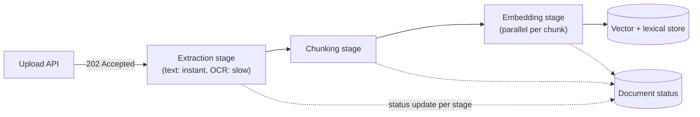

# System Design: Document Processing

## 1. Requirements

Design a system that accepts an uploaded document (PDF, Markdown, plain text), extracts its text,
splits it into retrievable chunks, generates embeddings, and makes it searchable — the ingestion
pipeline behind a RAG system (see [RAG architecture](../ai-engineering/rag-architecture.md)). Chosen
as the fifth worked exercise because its central tension is unlike anything the earlier exercises
face: a single logical operation (process one document) that decomposes into stages with wildly
different latency profiles — a text extraction step that's near-instant for plain text but can take
minutes for a large scanned PDF needing OCR — which breaks any design that treats "process the
upload" as one uniform unit of work.

## 2. Functional requirements

- A user uploads a document; the system extracts its text content.
- The extracted text is split into bounded-size, paragraph-aware chunks (see
  [embeddings](../ai-engineering/embeddings.md)).
- Each chunk is embedded and stored, ready for retrieval.
- A user can query the processing status of an uploaded document (queued, processing, ready, failed).
- A user can delete a document, which removes it and all its derived chunks/embeddings.

## 3. Non-functional requirements

- **Wildly variable per-document processing time**: seconds for a short Markdown file, potentially
  minutes for a large, image-heavy PDF requiring OCR — the design must not let one slow document
  block or delay unrelated ones.
- **No partial, silently-broken documents**: a document is either fully processed (extracted,
  chunked, embedded, indexed) and marked ready, or it's marked failed with a reason — never left in
  an ambiguous, half-indexed state a query might silently return incomplete results from.
- **Idempotent reprocessing**: retrying a failed stage, or reprocessing a document after an update,
  must not leave duplicate or orphaned chunks behind.
- **Not required**: real-time processing (seconds-scale latency is fine; there's no interactive user
  waiting synchronously for the result), support for arbitrary binary formats beyond a defined
  allowlist.

## 4. Assumptions

- 50,000 documents uploaded/day (~0.6/sec average), average 15 pages, ~40KB extracted text per
  document.
- 90% of uploads are plain text or Markdown (near-instant extraction); 10% are PDFs, of which roughly
  a quarter need OCR (a scanned or image-based PDF, not text-layer-extractable directly) — this 2.5%
  minority of uploads is what actually drives the pipeline's worst-case latency and resource
  planning, not the 90% majority.
- Chunking budget: ~2000 characters/chunk, paragraph-aware — an average document produces ~20 chunks.
- Embedding generation: ~50ms/chunk on the embedding model in use.

## 5. Capacity estimation

- Extraction stage: 90% of uploads complete in under 1 second; the 2.5% needing OCR can take
  30 seconds to several minutes — at 50K uploads/day, ~1,250 OCR jobs/day, each holding real compute
  (an OCR worker) for potentially minutes, meaning OCR capacity has to be planned around concurrent
  *duration*, not just job count, unlike every other stage in this pipeline.
- Embedding stage: 50K docs/day × ~20 chunks/doc = 1M chunks/day (~12/sec average) × 50ms/chunk ≈
  ~600 seconds of embedding compute/day at steady state — trivial in aggregate, but each individual
  document's ~20 chunks can be embedded in parallel, which is the actual latency lever for a single
  document's end-to-end processing time (§10).
- The real capacity insight: aggregate throughput across the whole pipeline is comfortably low
  (well under 1 doc/sec average) — the design challenge isn't raw scale, it's stage-latency variance,
  which is a queueing and isolation problem, not a horizontal-scaling one.

## 6. High-level architecture



This diagram answers: *why does a large OCR-bound PDF not delay processing for the plain-text
document uploaded right after it?* Because each stage is its own independently scaled worker pool
consuming from its own queue — a slow extraction job occupies one OCR worker for its full duration,
but the plain-text document behind it in the *upload* queue reaches the extraction stage through a
worker that's free within milliseconds, not stuck waiting behind the OCR job specifically. This is
the [bulkhead](../resilience/bulkhead.md) pattern applied at the pipeline-stage level: isolating one
document's slow processing from every other document's throughput, the same isolation principle a
thread-pool bulkhead gives one dependency versus the rest of an application.

## 7. Data model

```text
documents
  id                uuid         primary key
  status            varchar(12)  not null            -- QUEUED | EXTRACTING | CHUNKING | EMBEDDING | READY | FAILED
  failure_reason    text         null
  uploaded_at       timestamptz  not null
  ready_at          timestamptz  null

chunks
  id                uuid         primary key
  document_id       uuid         not null references documents(id)
  ordinal           int          not null             -- packing order, per ADR-0006's model
  content           text         not null
  embedding         vector(1024) null                 -- null until the embedding stage completes
```

`chunks.embedding` being nullable, populated only once the embedding stage completes, is deliberate —
it's what makes "fully processed vs partially processed" a real, queryable distinction (a chunk row
existing with no embedding means chunking succeeded but embedding hasn't, directly visible without
inferring it from `documents.status` alone).

## 8. API design

```text
POST /documents
  multipart body: file
  202: { "document_id": "...", "status": "QUEUED" }

GET /documents/{id}
  200: { "document_id": "...", "status": "READY", "chunk_count": 22 }

DELETE /documents/{id}
  204   -- cascades to all derived chunks/embeddings
```

## 9. Communication model

Upload is a synchronous, size-and-type-validated `POST` that only confirms *acceptance* — the same
`202`-then-poll pattern as [order processing §9](order-processing.md#9-communication-model) and
[notification system §9](notification-system.md#9-communication-model), chosen for the identical
reason: the real processing (especially OCR) can take far longer than any reasonable synchronous
request timeout, so the upload response and the eventual "ready" state are deliberately decoupled.

## 10. Scaling strategy

- Each pipeline stage (extraction, chunking, embedding) is an independent
  [consumer group](../messaging/consumer-groups.md) with its own worker pool, scaled to its own
  stage's actual resource profile — OCR workers are CPU/memory-heavy and provisioned for duration,
  embedding workers are provisioned for the model's own throughput ceiling, and neither pool's
  sizing constrains the other's.
- Within one document, the ~20 chunks produced by chunking are embedded in parallel — the fan-out/
  fan-in shape [agents and workflows](../ai-engineering/agents-and-workflows.md) uses for a
  multi-step pipeline's stages that fan out internally, recording per-chunk results without needing a
  separate row per chunk-embedding attempt.
- Extraction specifically separates a fast path (plain text/Markdown, effectively synchronous within
  the stage) from a slow path (OCR, routed to a dedicated, smaller worker pool) — the 2.5%-of-uploads
  OCR case never competes for the same worker capacity the 97.5% fast path uses.

## 11. Consistency model

A document's status is the single source of truth for "is this fully processed," updated by each
stage on completion — a document is only ever queryable as `READY` once every chunk has a non-null
embedding and is indexed, never partially. Between stages, the document is legitimately in an
intermediate, non-terminal status (`EXTRACTING`, `CHUNKING`, `EMBEDDING`) — the same eventual-
consistency shape as [order processing](order-processing.md)'s saga, just linear instead of
choreographed across independent services, since every stage here belongs to the same ingestion
pipeline rather than separately owned participants.

## 12. Failure handling

- **A stage fails partway** (extraction succeeds, chunking fails on malformed content). The document
  is marked `FAILED` with the specific stage and reason recorded — never left in an ambiguous status
  a query might mistake for in-progress — and retried from that stage, not from scratch, once the
  underlying issue is fixed.
- **A worker crashes mid-embedding, having embedded 12 of 20 chunks.** Reprocessing re-embeds only
  the chunks still missing an embedding (the nullable `embedding` column makes this a simple query),
  not all 20 — idempotent by construction, the same idempotent-resume discipline
  [agents and workflows](../ai-engineering/agents-and-workflows.md) uses for a multi-step pipeline.
- **A document is deleted while mid-processing.** The delete cascades to any chunks that already
  exist, and in-flight stage workers check the document's existence before writing further chunks —
  a race a naive "delete the row, ignore anything already queued" approach would leave as orphaned
  chunk data with no owning document.

## 13. Observability

- Per-stage processing latency (extraction, chunking, embedding), tracked separately, not as one
  aggregate "processing time" — a rising extraction latency specifically means something different
  (OCR backlog) than a rising embedding latency (the embedding model degrading), and conflating them
  hides which one to actually investigate.
- Documents stuck in a non-terminal status past a threshold are the leading indicator of a stuck
  pipeline stage, the document-processing equivalent of
  [order processing §13](order-processing.md#13-observability)'s stuck-saga metric.
- `document_id` is the correlation ID tying extraction, chunking, and embedding stage logs together
  for one document's full processing trace.

## 14. Security

- Uploaded file type and size are validated before extraction even begins — an unbounded or
  unvalidated upload is a direct [denial-of-wallet](../resilience/rate-limiting.md)-shaped resource-
  exhaustion risk, the same T5 concern named in
  [AI security](../ai-engineering/ai-security.md)'s sibling material.
- Extracted text and any document metadata rendered in a UI must be rendered as literal text, never
  as markup — a document's own filename or title is exactly the kind of user-supplied string
  [AI security](../ai-engineering/ai-security.md) names as a real, previously-found stored-XSS path
  elsewhere.
- Document access control is checked at query and retrieval time, not only at upload — a chunk
  belonging to a document one user uploaded must never surface in another user's retrieval results
  without an explicit sharing grant.

## 15. Cost considerations

The embedding stage's model-inference cost is the dominant, ongoing cost driver (unlike storage,
which stays small per §5) — and it scales with chunk count, not document count, which makes chunk
size (§4's 2000-character budget) a direct cost lever: a smaller chunk budget means more chunks per
document and proportionally more embedding calls for the same underlying text, a real trade against
[retrieval quality](../ai-engineering/retrieval-reranking.md) that has to be weighed, not decided by
cost alone.

## 16. Alternatives

- **One monolithic processing function instead of staged workers.** Simpler to write and reason
  about for a single document, but a slow OCR call inside one function call means the same call is
  holding a worker for minutes, unable to isolate that document's latency from unrelated ones —
  rejected for exactly the reason §6's bulkhead-shaped design exists.
- **Synchronous processing, blocking the upload response until fully ready.** Would remove the need
  for a status-polling API entirely, but makes upload latency equal to the slowest possible OCR job
  (potentially minutes) — an unacceptable user-facing wait, and the same rejection reasoning as every
  other exercise's sync-vs-async communication-model decision.

## 17. Evolution path

- **Semantic (embedding-based) chunking** instead of the paragraph-aware baseline — a real quality
  improvement [embeddings](../ai-engineering/embeddings.md) names explicitly, deferred in the
  baseline because it roughly doubles embedding load for a benefit only measurable once an evaluation
  harness (see [Evaluation](../ai-engineering/evaluation.md)) exists to confirm it's worth that cost.
- **Incremental reprocessing on document update** (re-extract and re-chunk only the changed portion
  of a document, not the whole thing) — a meaningfully more complex diff-aware pipeline, not an
  incremental change to the current full-reprocess model.
- **A dedicated OCR worker autoscaling policy** driven by queue depth specifically, separate from the
  rest of the pipeline's scaling — since OCR's duration-bound (not count-bound) resource profile
  means a naive count-based autoscaler would under-provision it relative to its real load.
