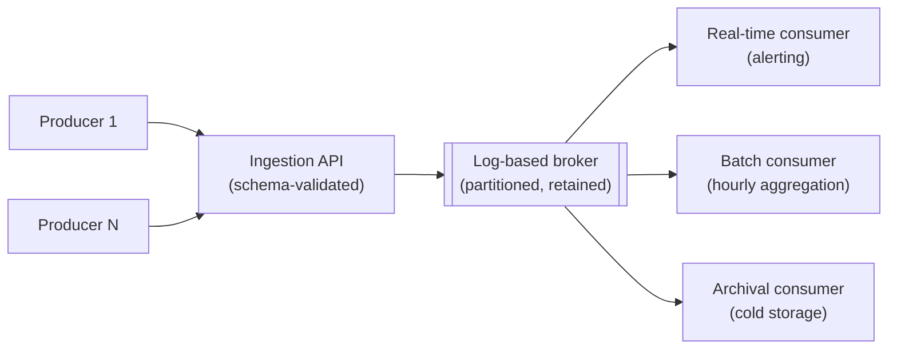

# System Design: Event Ingestion Platform

## 1. Requirements

Design a platform that accepts a very high volume of small, independent events (analytics events,
IoT telemetry, application logs) from many uncoordinated producers, and makes them available to
multiple independent consumers — a real-time alerting pipeline, a batch analytics job, a long-term
archive — each reading the same stream at their own pace. Chosen as the sixth and final worked
exercise because its central tension is different in kind from every prior one: there's no single
"the consumer" to design around — the same ingested event has to serve a millisecond-latency reader
and a once-a-day batch job equally well, from one write path.

## 2. Functional requirements

- Producers publish events (a JSON payload plus a type and timestamp) to the platform, at high
  volume, with no coordination between producers required.
- Multiple, independent consumer types read the event stream: a real-time consumer (alerting,
  sub-second), a batch consumer (hourly/daily aggregation), and a long-term archive (queryable much
  later, at lower urgency).
- Event schemas can evolve over time (new fields added, rarely a field removed) without breaking
  existing consumers reading old and new events side by side.
- A consumer can be added later and, if needed, replay historical events from an arbitrary point,
  not just consume from "now."

## 3. Non-functional requirements

- **Very high sustained write throughput**, bursty around real-world triggers (a marketing campaign,
  a device firmware rollout) — the write path must never apply backpressure to producers by rejecting
  events under normal load.
- **At-least-once delivery to every consumer** — an event accepted by the platform must eventually
  reach every consumer subscribed to it, even across a consumer outage or restart.
- **Schema evolution without breaking existing consumers** — an old consumer reading a newly
  schema-extended event must not fail just because it doesn't recognize a new field.
- **Not required**: exactly-once delivery (consumers are expected to be idempotent, per
  [delivery semantics](../messaging/delivery-semantics.md)), strict cross-producer ordering (only
  per-producer or per-entity ordering is guaranteed — see §11).

## 4. Assumptions

- 200,000 events/sec average, bursting to 1M events/sec during peak windows (a 5x multiplier).
- Average event size: 500 bytes.
- Retention: 7 days of hot, immediately-replayable storage for real-time and batch consumers; events
  older than 7 days are archived to cold storage, still queryable but at higher latency.
- Producers are numerous and largely uncoordinated (thousands of independent services/devices) —
  no single producer's behavior can be assumed well-behaved, and a single misbehaving producer must
  not be able to degrade ingestion for every other producer.

## 5. Capacity estimation

- Write throughput: 200K events/sec × 500 bytes ≈ 100 MB/sec average, ~500 MB/sec at peak — this is
  squarely in the range a log-based broker (see [Kafka](../messaging/kafka.md)) is built for, and is
  the deciding factor over a traditional queue for this exercise specifically (§16).
- Hot storage: 100 MB/sec average × 7 days ≈ ~60 TB of hot, replayable retention — a real, planned
  cost (§15), not incidental, and directly why retention window is an explicit, tunable parameter
  rather than "keep everything forever."
- Consumer fan-out: three independent consumer types reading the same stream at their own pace means
  the write path's throughput requirement is paid *once*; each consumer's own read throughput is
  independent and doesn't multiply write-side load — the single most important capacity fact this
  design rests on (§6).

## 6. High-level architecture



This diagram answers: *why can three consumers with such different latency needs (sub-second vs
hourly vs "eventually") all read from the same log, without the fast consumer waiting on the slow one
or the slow one forcing extra write-side capacity?* Because a log-based broker doesn't remove data on
consumption — each consumer tracks its own independent read offset into the same retained log (the
exact property [Kafka](../messaging/kafka.md) names: replay is just "read from an earlier offset,"
not a special mechanism). The real-time consumer stays near the head of the log; the batch consumer
might be hours behind; the archival consumer might process once a day — none of that affects the
other two, because each is reading its own position in data that was written once and retained,
not delivered-and-removed per consumer.

## 7. Data model

```text
-- Log-based broker (not a relational schema) — the actual "data model" is the event envelope:
event envelope
  event_id          uuid          -- for idempotent consumer-side deduplication
  event_type        string        -- e.g. "page_view", "sensor.temperature"
  schema_version    int           -- consumers branch on this, not on field presence alone
  producer_id       string        -- partition key (see §10)
  occurred_at       timestamp
  payload           json          -- schema evolves additively; old fields never repurposed
```

`schema_version` being explicit, rather than consumers inferring the schema from which fields happen
to be present, is deliberate — it's what makes "does this consumer understand this event" a direct
check instead of defensive, ad hoc field-presence guessing on every read.

## 8. API design

```text
POST /events
  body: { "event_type": "...", "schema_version": 2, "payload": {...} }
  202: { "event_id": "..." }

POST /events:batch
  body: { "events": [...] }              -- for producers that batch client-side to reduce request count
  202: { "accepted": 950, "rejected": 2, "rejected_ids": [...] }
```

## 9. Communication model

Ingestion is fire-and-forget from the producer's perspective — `202`, confirming acceptance into the
broker, never confirming any consumer has processed the event, since at ingestion time the platform
has no way to know which consumers will eventually read it or when. This is a stronger version of
every other exercise's sync/async split: here, there isn't even a status endpoint for a producer to
poll, because "processed" isn't a single, well-defined state across three independent consumers with
different notions of done — each consumer's own downstream system is where that status would live,
not the ingestion platform.

## 10. Scaling strategy

- The broker is partitioned by `producer_id` (or a more granular entity ID inside the payload, when
  per-entity ordering matters more than per-producer ordering) — giving per-key ordering with full
  cross-key parallelism, the identical mechanism [consumer groups](../messaging/consumer-groups.md)
  and [ordering](../messaging/ordering.md) describe, applied at ingestion scale.
- Because consumers each maintain independent offsets, adding a fourth consumer type later requires
  zero changes to the write path or to any existing consumer — it just starts reading from whatever
  offset it chooses, the direct payoff of the log-based model over a traditional queue.
- A single misbehaving or unusually high-volume producer is bounded by
  [rate limiting](../resilience/rate-limiting.md) applied per producer at the ingestion API, not a
  global limit — protecting aggregate ingestion capacity from one producer's traffic without
  penalizing every other producer's normal-volume traffic.

## 11. Consistency model

Per-`producer_id` (or per-entity, depending on partition key choice) ordering is the one guarantee,
identical in shape to [order processing](order-processing.md)'s per-order ordering — there is no
guarantee of ordering across different producers, and consumers reading across partitions must not
assume a global sequence. Each consumer's view of "what's been processed" is independently eventually
consistent with the write path — a batch consumer hours behind the real-time one is not a fault, it's
the batch consumer's own chosen cadence, exactly the same "no mid-flight synchronization guarantee,
only convergence" shape as [eventual consistency](../distributed-systems/eventual-consistency.md).

## 12. Failure handling

- **A producer retries a send after a timeout, unsure whether the first attempt landed.** The
  platform accepts the duplicate (at-least-once, not exactly-once, per §3) — every consumer is
  expected to deduplicate on `event_id`, the same idempotent-consumer discipline
  [delivery semantics](../messaging/delivery-semantics.md) requires generally.
- **A consumer falls behind or crashes.** Because the log retains events independently of consumption,
  a recovering consumer simply resumes from its last committed offset — no data loss, only a
  temporary lag that resolves as the consumer catches up, unlike a traditional queue where a crashed
  consumer's unacknowledged messages need a redelivery mechanism to avoid being lost.
- **An event fails schema validation at ingestion.** Rejected at the ingestion API directly (part of
  the `202`'s per-event accept/reject response in §8), not accepted and dead-lettered downstream —
  catching a malformed event at the door is cheaper than letting every consumer independently
  discover and handle the same malformed payload.

## 13. Observability

- Consumer lag (per consumer, per partition) is the primary health signal — the
  [consumer groups](../messaging/consumer-groups.md) metric, here tracked separately per consumer
  *type*, since a batch consumer's expected lag (hours) and a real-time consumer's expected lag
  (milliseconds) need entirely different alert thresholds, not one shared one.
- Ingestion accept/reject rate per producer is the leading indicator of a producer sending malformed
  or schema-mismatched events, worth surfacing back to that producer's own team directly, not just
  as an aggregate platform metric.
- `event_id` and `producer_id` together are the correlation keys for tracing one event's path from
  ingestion through to each consumer's processing.

## 14. Security

- The ingestion API authenticates each producer individually — no shared ingestion credential across
  all producers, so a compromised producer's blast radius is bounded to its own traffic and doesn't
  grant broader platform access.
- Payload content is schema-validated but not assumed trustworthy beyond that — a consumer processing
  event payloads must treat field values as untrusted input, the same discipline any system
  processing external data needs, independent of the ingestion platform's own validation.
- Per-producer rate limits (§10) double as a security control, not just a capacity one — bounding the
  damage a compromised or malfunctioning producer can do to shared ingestion capacity.

## 15. Cost considerations

Hot storage (§5's ~60 TB for a 7-day retention window) is the dominant, directly tunable cost driver
— unlike chat's storage (driven by cumulative message volume with no natural expiry) or document
processing's (driven by embedding compute), here the retention *window* itself is the lever: shorter
hot retention lowers cost directly but shortens how far back a consumer can replay without falling
back to slower, cheaper cold storage — a real trade between replay flexibility and cost, decided per
the platform's actual consumer needs, not defaulted to either extreme.

## 16. Alternatives

- **A traditional queue (e.g., RabbitMQ) instead of a log-based broker.** Would work fine for a
  single consumer, but a queue's messages are gone once consumed — three independent consumer types
  reading the same events at very different paces would each need their own separate queue, fed by a
  fan-out step at write time, multiplying write-side cost by consumer count instead of paying it
  once. Rejected specifically because §5's "pay once, consumers read independently" property is what
  a log-based broker gives for free and a queue-per-consumer model doesn't (see
  [Kafka vs RabbitMQ](../messaging/kafka.md) for the general version of this trade-off).
- **A single consumer processing all three concerns (real-time, batch, archive) in one code path.**
  Would avoid running three separate consumer deployments, at the cost of coupling three genuinely
  different latency and failure profiles into one process — a bug or slowdown in the archival logic
  would risk delaying real-time alerting, exactly the isolation a [bulkhead](../resilience/bulkhead.md)
  exists to prevent, applied here at the consumer-process level instead of a thread pool.

## 17. Evolution path

- **Schema registry with compatibility enforcement**: rejecting a producer's schema change at publish
  time if it would break existing consumers (removing a field consumers depend on), rather than
  relying on additive-only discipline as a convention — a real, enforced fitness function (see
  [evolutionary architecture](../architecture/evolutionary-architecture.md)) for schema evolution
  specifically, not built in the baseline design.
- **Tiered hot/cold storage automation**: today's 7-day cutoff is a fixed parameter; a genuinely
  useful evolution is per-event-type retention policy, since some event types (billing-relevant)
  plausibly need longer hot retention than others (debug telemetry).
- **A stream-processing layer** (windowed aggregation, joins across event types) sitting between the
  broker and the batch consumer, for consumers that need more than "read events, aggregate
  externally" — a meaningfully larger platform capability, not an incremental addition to this
  design's ingestion-and-fan-out scope.
