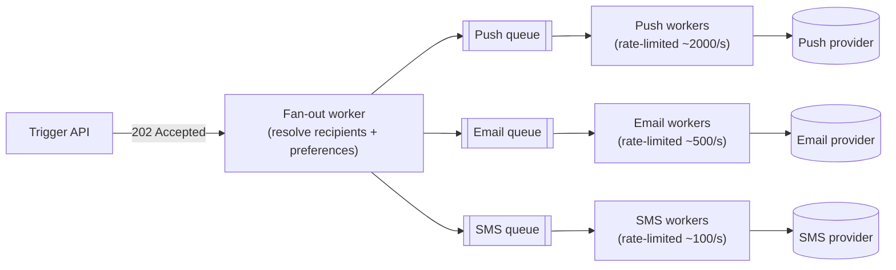

# System Design: Notification System

## 1. Requirements

Design a system that lets internal services trigger a notification to one user or a large segment
of users, delivered across push, email, and SMS, respecting each user's channel preferences and
quiet hours. Chosen as the second worked exercise specifically because its central tension — a
trigger that can fan out to millions of recipients instantly, feeding third-party providers that
rate-limit to a few hundred sends per second — puts several Phase 2/3 concepts
([backpressure](../resilience/backpressure.md), [consumer groups](../messaging/consumer-groups.md),
[idempotency](../distributed-systems/idempotency.md)) to work in one concrete design, in a way the
read-heavy [URL shortener](url-shortener.md) never needed to.

## 2. Functional requirements

- An internal service triggers a notification: single user, or a segment (e.g., "all users with
  feature flag X").
- The system renders a template with the caller's data and resolves which channel(s) to use per
  recipient, based on that user's preferences.
- Delivery is attempted across push, email, and SMS as configured, falling back to the next
  preferred channel if the primary fails.
- Users can opt out per channel and set quiet hours (no push/SMS during a configured local-time
  window; email is exempt since it isn't interruptive).
- Delivery status (sent, delivered, failed) is queryable per notification.

## 3. Non-functional requirements

- **Bursty, high fan-out**: a single trigger can address up to ~10M users near-instantly, which is
  qualitatively different from the URL shortener's steady per-request load.
- **At-least-once delivery to at least one channel** — a notification the system accepted should not
  be silently dropped, even under a provider outage.
- **No duplicate sends** on retry — a flaky provider acknowledgment must not cause the same user to
  receive the same notification twice on the same channel.
- **Provider-rate-limit compliance**: exceeding a provider's own rate limit risks that provider
  throttling or banning the account entirely, which is a far worse outage than a backlog.
- **Not required**: strict ordering between unrelated notifications, real-time (sub-second) delivery
  guarantee for low-priority notifications — see the digest evolution in §17.

## 4. Assumptions

- Steady-state: 50M notifications/day (~580/sec average) from routine per-user triggers (an order
  shipped, a comment reply).
- Burst case: a broadcast segment of up to 10M users, expected to fan out within roughly 10 minutes
  → ~16,700 user-notification records/sec at burst peak.
- Provider throughput ceilings (illustrative, provider-specific in reality): push ~2,000/sec, email
  ~500/sec, SMS ~100/sec. **This asymmetry — fan-out can happen far faster than any provider can
  absorb — is the single architectural fact that shapes the entire design.**
- SMS costs roughly 100x more per message than push; cost is a real input to channel selection, not
  just a scaling concern (see §15).
- Each user has an ordered channel preference (e.g., push, then email, then SMS) used for fallback.

## 5. Capacity estimation

- Storage: a notification record (~200 bytes: user ID, channel, status, timestamps, template ref) at
  50M/day → ~3.6 GB/day, ~1.3 TB/year — not the cost driver; provider API cost is (§15).
- The gap between burst fan-out (16,700/sec) and the slowest provider (SMS, ~100/sec) is roughly
  **167x** — a queue absorbing that gap isn't optional, it's the only way the burst case doesn't
  either overwhelm SMS's rate limit or block the fan-out step waiting for SMS capacity.

## 6. High-level architecture



This diagram answers: *where does the 167x rate mismatch between fan-out and SMS actually get
absorbed?* In the `SmsQ` queue, not in the trigger request and not by blocking the fan-out worker —
the fan-out step writes every recipient's notification record to its channel's queue as fast as it
can resolve preferences, and each channel's worker pool drains its own queue at exactly that
channel's safe rate. A burst that produces 10M SMS-preferred notifications doesn't fail; it queues,
and drains over roughly 28 hours at 100/sec — which is a capacity and product conversation (should
SMS ever be the fallback for a 10M-user broadcast at all?), not a system failure, precisely because
the queue made the mismatch visible instead of silently overwhelming the provider.

## 7. Data model

```text
notifications
  id                uuid         primary key
  event_id          uuid         not null          -- groups all recipients of one trigger
  user_id           bigint       not null
  channel           varchar(10)  not null           -- push | email | sms
  status            varchar(10)  not null           -- queued | sent | delivered | failed
  idempotency_key   varchar      unique not null     -- (event_id, user_id, channel)
  created_at        timestamptz  not null
  sent_at           timestamptz  null

user_preferences
  user_id           bigint       primary key
  channel_order     text[]       not null            -- e.g. ['push', 'email', 'sms']
  opted_out         text[]       not null default '{}'
  quiet_hours_start time         null
  quiet_hours_end   time         null
  timezone          varchar      not null
```

The `idempotency_key` (`event_id`, `user_id`, `channel`) is the field that does the real work here —
see [idempotency](../distributed-systems/idempotency.md) for why the check-and-record step must be
atomic with the send attempt, not just present as a column.

## 8. API design

```text
POST /notifications/trigger
  body: { "event_id": "...", "template": "order_shipped", "recipients": {...}, "data": {...} }
  202: { "event_id": "...", "status_url": "/notifications/events/{event_id}/status" }

GET /notifications/events/{event_id}/status
  200: { "total": 10000000, "sent": 8213045, "delivered": 8100221, "failed": 12034 }
```

## 9. Communication model

The trigger call is synchronous but only confirms *acceptance*, not delivery — 202, not 200 — because
fan-out and per-channel dispatch are genuinely asynchronous work that can take minutes to hours for
a large segment (see [communication model reasoning](url-shortener.md#9-communication-model) in the
URL shortener exercise for the same sync/async split applied to a very different read/write ratio).
Delivery status is polled or pushed via webhook back to the triggering service, never held open on
the original request.

## 10. Scaling strategy

- **Fan-out** scales horizontally by partitioning the recipient list across workers (e.g., by
  `user_id` hash) — each partition independently resolves preferences and writes to the channel
  queues, so fan-out throughput scales with worker count, not with provider limits.
- **Channel dispatch** is a [consumer group](../messaging/consumer-groups.md) per channel, but
  worker *count* is deliberately capped below what would exceed the provider's rate limit — more
  consumers would not increase real throughput here, only increase contention against an external
  rate limit the system doesn't control, which is the notification-system-specific version of the
  hot-partition lesson in the consumer-groups topic.
- **Backpressure** is structural, not incidental: the channel queues *are* the
  [bounded queue that absorbs a producer/consumer rate mismatch](../resilience/backpressure.md) —
  the fan-out worker never blocks waiting for SMS capacity, and SMS capacity never gets exceeded,
  because the queue sits between them by design.

## 11. Consistency model

Eventually consistent by design — a triggered broadcast's delivery status converges over minutes to
hours, and that's an accepted property, not a defect, given §3's requirements don't demand real-time
delivery for every notification. The one strong guarantee: `idempotency_key` uniqueness ensures a
given (event, user, channel) triple is never double-sent, which is the specific guarantee retries
need (see [delivery semantics](../messaging/delivery-semantics.md) — this is at-least-once delivery
to the provider, made safe by an idempotent send).

## 12. Failure handling

- **Provider outage**: a [circuit breaker](../resilience/circuit-breaker.md) per provider trips on
  sustained failures, and the fallback path tries the user's next-preferred channel instead of
  retrying the down provider immediately — this is why channel preference is an *ordered list*, not
  a single choice: it's the concrete fallback mechanism, not just a UX setting.
- **Exhausted fallback**: a notification that fails on every channel in a user's preference list
  goes to a dead-letter queue for manual or scheduled reprocessing, rather than being silently
  dropped — mirrors the DLQ pattern from [delivery semantics](../messaging/delivery-semantics.md).
- **Retry storms into an already-degraded provider**: bounded by a
  [retry budget](../resilience/timeout-and-retry-budgets.md) per provider, not per-notification —
  without this, a provider outage during a 10M-recipient broadcast would multiply retry traffic onto
  a provider that's already failing, exactly the retry-storm mechanism that topic describes.

## 13. Observability

- Per-channel delivery success rate is the primary SLI (see
  [SLOs vs SLIs](../observability/slos-vs-slis.md)) — tracked separately per channel, since a push
  outage and an SMS outage are different incidents with different fallback behavior, not one blended
  "notifications" number.
- Queue depth per channel is the leading indicator of an approaching provider-capacity problem, well
  before delivery success rate itself moves.
- `event_id` is the [correlation ID](../observability/correlation-ids.md) that ties one trigger's
  entire fan-out — potentially millions of individual sends — back together for status aggregation
  and debugging.

## 14. Security

- The trigger API must authorize the *caller service*, not just authenticate it — an internal service
  should only be able to trigger templates and segments it's scoped to, so a compromised or buggy
  service can't broadcast to the entire user base.
- Rate-limit triggering per calling service, independent of the per-user channel rate limits, to
  bound the blast radius of a misconfigured or malicious caller.
- Notification content and recipient PII must not appear in logs or metrics labels — only IDs and
  status, consistent with the correlation-ID guidance against embedding sensitive data in a widely
  propagated identifier.

## 15. Cost considerations

Unlike the URL shortener, where storage was the negligible cost and cache sizing was the real lever,
here **provider cost per message is the dominant cost, and it varies roughly 100x by channel** (SMS
far more expensive than push). This makes channel *ordering* a cost decision, not just a UX one — a
user's preference list should default to cheaper channels first where product requirements allow,
and any override to an expensive channel (SMS) for a low-priority notification is a cost bug, not
just a UX one.

## 16. Alternatives

- **Synchronous fan-out from the trigger request** (call providers directly, no queue): rejected —
  the trigger caller would block for however long it takes to dispatch to every recipient, which for
  a 10M-user broadcast is hours, and any partial failure mid-request has no clean recovery story.
- **No per-channel queue, single shared dispatch queue**: rejected — without separating by channel,
  a burst of SMS-preferred notifications would sit behind (or block) push notifications in the same
  queue, coupling two channels with very different rate limits and turning a slow channel into a
  head-of-line blocker for a fast one.

## 17. Evolution path

- **Digest batching** for low-priority notification types: instead of sending each one immediately,
  accumulate per user over a window (e.g., hourly) and send one summary — reduces both provider cost
  and notification fatigue, at the cost of losing per-notification real-time delivery for that
  category, an explicit product trade-off.
- **Per-user frequency capping**: a hard cap on notifications per user per day across all triggering
  services, requiring a shared counter the fan-out step checks before enqueueing — a new coordination
  point not present in the current design.
- **Engagement-based channel selection**: replacing the static preference-order fallback with a
  model that picks the channel most likely to be acted on per user, informed by delivery/open history
  — a meaningfully different system (needs a feedback loop from delivery status back into channel
  selection) rather than an incremental change to this design.
