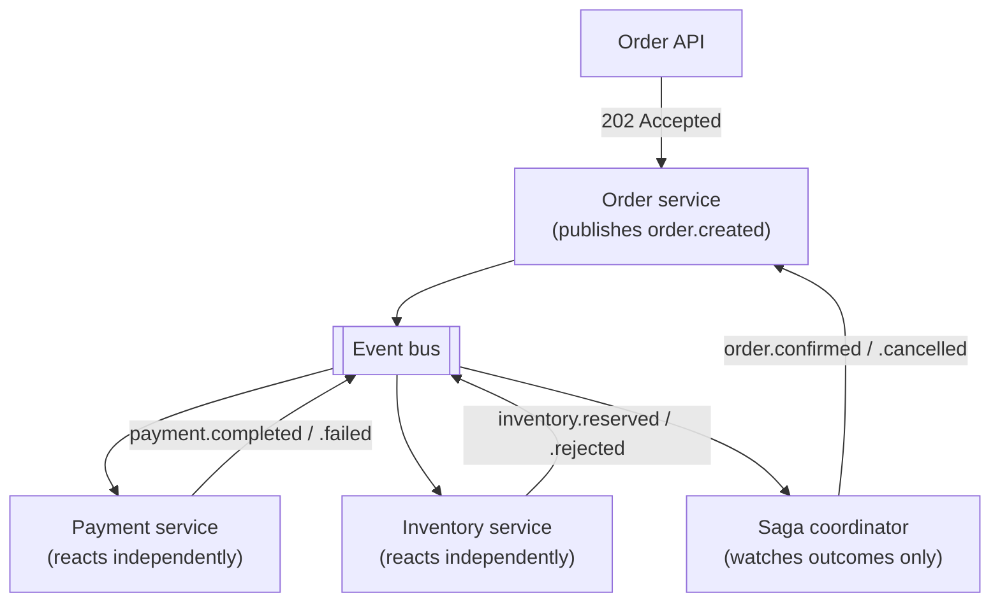

# System Design: Order Processing

## 1. Requirements

Design a system that accepts an order (a customer, a set of line items), reserves inventory, charges
payment, and confirms or cancels the order depending on whether both succeed — with payment and
inventory each owned by a separate service, no shared database, and no distributed transaction.
Chosen as the third worked exercise specifically because its central tension is multi-step
correctness *without* atomicity across services, putting
[eventual consistency](../distributed-systems/eventual-consistency.md) and
[event-driven architecture](../distributed-systems/event-driven-architecture.md) to work end to end,
in a way the read-heavy [URL shortener](url-shortener.md) and the fan-out-heavy
[notification system](notification-system.md) never needed to.

## 2. Functional requirements

- A client submits an order: customer ID, line items (product, quantity, unit price).
- The system reserves inventory for each line item and charges payment for the order total.
- If both succeed, the order is confirmed. If either fails, the order is cancelled and whatever
  already succeeded (a payment charge, an inventory reservation) is compensated (refunded, released).
- A client can query an order's current status at any time.
- Order history is retained and queryable per customer.

## 3. Non-functional requirements

- **No distributed transaction across services** — payment and inventory are owned by separate
  teams/services with their own databases; a 2PC-style coordinator is explicitly rejected (see §16).
- **Convergence, not synchronization** — every order reaches exactly one terminal state
  (`CONFIRMED` or `CANCELLED`) within a bounded time, but intermediate disagreement between the
  order, payment, and inventory records is expected and acceptable.
- **No double charges, no double reservations** — a retried or redelivered event must not cause
  payment or inventory to apply their effect twice.
- **Not required**: real-time (sub-second) order confirmation — a few seconds of convergence latency
  is acceptable; strict ordering between unrelated customers' orders.

## 4. Assumptions

- 500K orders/day (~6/sec average), peaking at 10x during sales events (~60/sec).
- Average 3 line items per order.
- Payment provider p99 latency: 800ms. Inventory check: 50ms (local database).
- Payment and inventory are independently deployed services, each with their own datastore — no
  shared schema, no foreign keys crossing the boundary.
- Both payment and inventory can independently fail (provider timeout, insufficient stock) — the
  design has to handle either leg failing without the other having reported yet.

## 5. Capacity estimation

- At 60 orders/sec peak, each producing one `order.created` event consumed by two independent
  listeners (payment, inventory), the messaging layer needs to sustain ~120 consumer-side operations/
  sec at peak — comfortably within a single Kafka partition's typical throughput, so partition count
  is driven by *ordering* needs (§10), not raw throughput.
- Saga state storage: one row per order (~300 bytes: order ID, payment status, inventory status,
  timestamps) — at 500K/day, ~55 MB/year, negligible; this is not a storage-bound system.
- The real capacity question isn't storage or throughput — it's convergence latency under payment's
  800ms p99: a saga's slowest leg (payment) sets the floor on how fast any order can possibly reach a
  terminal state, which matters directly for §13's SLI choice.

## 6. High-level architecture



This diagram answers: *where does the decision to confirm or cancel actually get made, given that
payment and inventory never call each other or the order service directly?* In the saga coordinator,
and only there — it never calls payment or inventory, it only watches for their independently
published outcomes on the event bus and, once both are known, publishes the final decision as one
more event. This is choreography (see
[event-driven architecture](../distributed-systems/event-driven-architecture.md)): payment and
inventory each react only to `order.created`, with no awareness of each other or of the coordinator's
existence — adding a third participant later means one more listener, not a rewritten coordinator.

## 7. Data model

```text
orders
  id                uuid         primary key
  customer_id       bigint       not null
  status            varchar(12)  not null           -- CREATED | CONFIRMED | CANCELLED
  total_amount      numeric      not null
  created_at        timestamptz  not null

order_line_items
  id                uuid         primary key
  order_id          uuid         not null references orders(id)
  product_id        bigint       not null
  quantity          int          not null
  unit_price        numeric      not null

saga_state                                          -- owned by the coordinator only
  order_id          uuid         primary key
  payment_status     varchar(10) null                -- null = not yet reported
  inventory_status   varchar(10) null
  updated_at         timestamptz not null
```

`saga_state` is the only place that has ever seen both legs' outcomes together — `orders`, and
payment/inventory's own tables (owned by their respective services, not shown here), each only ever
know their own slice. Querying any one of them alone cannot tell you whether a saga is still in
flight or genuinely stuck.

## 8. API design

```text
POST /orders
  body: { "customer_id": "...", "line_items": [{"product_id": "...", "quantity": 2}] }
  202: { "order_id": "...", "status": "CREATED" }

GET /orders/{order_id}
  200: { "order_id": "...", "status": "CONFIRMED", "line_items": [...] }
```

## 9. Communication model

The order-creation call is synchronous but only confirms *acceptance* (`202`), not the final outcome
— the same sync/async split
[notification system §9](notification-system.md#9-communication-model) uses for a fan-out that takes
real time, applied here because payment and inventory processing genuinely can't complete within a
single request's reasonable timeout budget. A client polls `GET /orders/{id}` for the terminal state,
or subscribes to a webhook — the API never holds the request open waiting for both legs.

## 10. Scaling strategy

- The event bus is partitioned by `order_id`, giving per-order ordering (all of one order's events on
  one partition) while allowing full parallelism across orders — the exact pattern
  [consumer groups](../messaging/consumer-groups.md) describes: the partition, not the topic, is the
  unit of ordering and parallelism.
- Payment and inventory services scale independently of each other and of the order service — neither
  is in the other's critical path, and neither blocks order creation from accepting new orders.
- The saga coordinator scales horizontally by partitioning `saga_state` updates the same way (by
  `order_id`), since each order's saga state only needs to be updated by whichever instance is
  handling that order's partition.

## 11. Consistency model

Eventually consistent by design, with a precisely stated guarantee, not a slogan — see
[eventual consistency](../distributed-systems/eventual-consistency.md): every order converges to
exactly one of `CONFIRMED` (both legs succeeded) or `CANCELLED` (either leg failed, and whatever
already succeeded is compensated), given no further failures, within a bounded time. There is no
guarantee about *which* leg reports first, and no guarantee the order, payment, and inventory records
are ever simultaneously consistent mid-flight — a client reading the order immediately after
`POST /orders` will usually see `CREATED`, which is the guarantee working as designed, not a bug.

## 12. Failure handling

- **One leg fails, the other hasn't reported yet.** The coordinator doesn't wait for the slow leg to
  decide `CANCELLED` — it cancels as soon as *either* leg fails, then publishes `order.cancelled`,
  which payment and inventory each react to independently as their own compensation trigger (refund,
  release) — compensation is itself just another event, not a direct call from the coordinator.
- **A leg never reports at all.** If payment or inventory is down indefinitely, `saga_state` stays
  non-terminal forever with nothing to notice unless a saga-level timeout/reaper is explicitly built
  — a real, named limitation of the baseline design, not an oversight (see §17).
- **Retried/redelivered events.** Payment and inventory consumers are idempotent — a redelivered
  `order.created` doesn't charge or reserve twice, using the same idempotency-key discipline as
  [delivery semantics](../messaging/delivery-semantics.md) and the
  [notification system's](notification-system.md#7-data-model) `idempotency_key` pattern.

## 13. Observability

- Convergence time (order creation to terminal state) is the primary SLI — not payment or inventory's
  individual latency alone, since a slow saga can result from either leg or from the coordinator
  itself lagging.
- `saga_state` rows stuck non-terminal past a threshold are the leading indicator of a stuck saga,
  worth a dedicated dashboard panel distinct from the aggregate convergence-time metric (see
  [Metrics](../observability/metrics.md) — this is exactly the kind of metric that needs a real
  consumer, here a stuck-saga dashboard, to justify existing).
- `order_id` is the correlation ID (see [correlation IDs](../observability/correlation-ids.md)) tying
  the order, payment, and inventory records together for debugging one specific order's saga.

## 14. Security

- The order API authenticates the customer, but payment charge and inventory reservation calls are
  triggered by *events*, not directly by the client — a compromised client can create orders it's
  authorized for, never directly invoke payment or inventory logic.
- Payment amount is recomputed server-side from line items and current prices at order-creation time,
  never trusted from client input, closing the classic "client-supplied price" tampering vector.
- `saga_state` and order records never carry raw payment credentials — only a payment provider's own
  transaction/reference ID, keeping card data entirely inside the payment service's boundary.

## 15. Cost considerations

Unlike the URL shortener (storage-bound) or the notification system (provider-cost-bound), this
system's dominant cost is the payment provider's per-transaction fee, which doesn't scale with
architecture choices — the design's cost lever is instead avoiding *wasted* payment attempts:
retrying a payment charge that's already succeeded (caught by idempotency) would double-charge and
require an expensive, manual refund/dispute process, making idempotency here a direct cost control,
not just a correctness one.

## 16. Alternatives

- **A distributed transaction (2PC) across order, payment, and inventory databases.** Rejected: it
  would require all three services to share a transaction coordinator, blocking all three for the
  duration and coupling their availability together — exactly the cross-service coupling this design
  exists to avoid, and a real correctness risk if any one participant is briefly unreachable.
- **Orchestration instead of choreography** (a central coordinator explicitly calling payment and
  inventory). Would give one place that reads top-to-bottom as "the process," at the cost of the
  coordinator needing to know both services' APIs directly — reasonable at larger participant counts,
  but choreography's independence is worth more here at two participants (see
  [event-driven architecture](../distributed-systems/event-driven-architecture.md) for the full
  trade-off).

## 17. Evolution path

- **A saga-level timeout/reaper**: detects and resolves a saga stuck non-terminal past a threshold
  (e.g., cancel and compensate whatever succeeded) instead of leaving it stuck indefinitely — the
  concrete fix for §12's named limitation.
- **A third participant (e.g., shipping confirmation)**: adding a `shipping-service` listener on
  `order.created` and one more outcome topic for the coordinator to watch — no change needed to
  existing participants, the direct payoff of choreography named in §16.
- **Orchestration migration** if the participant count or branching complexity grows past what
  choreography stays legible for — a genuinely different shape, not an incremental change, per the
  trade-off in [event-driven architecture](../distributed-systems/event-driven-architecture.md).
